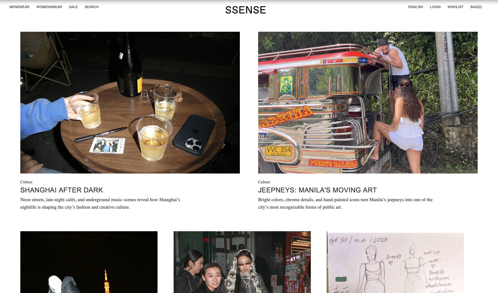
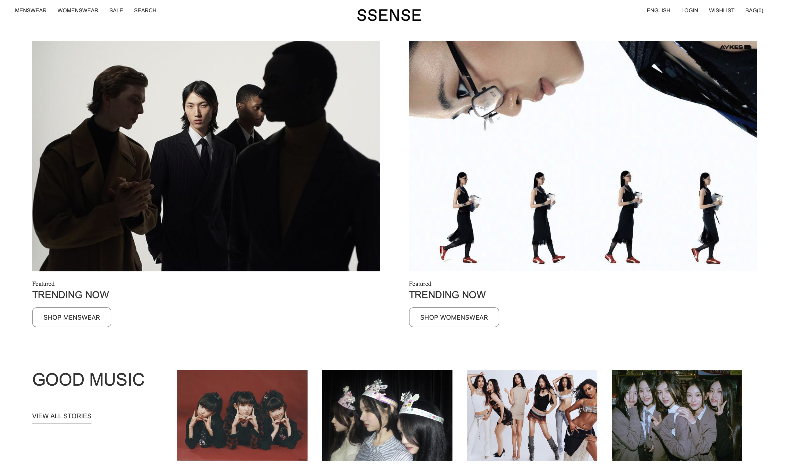
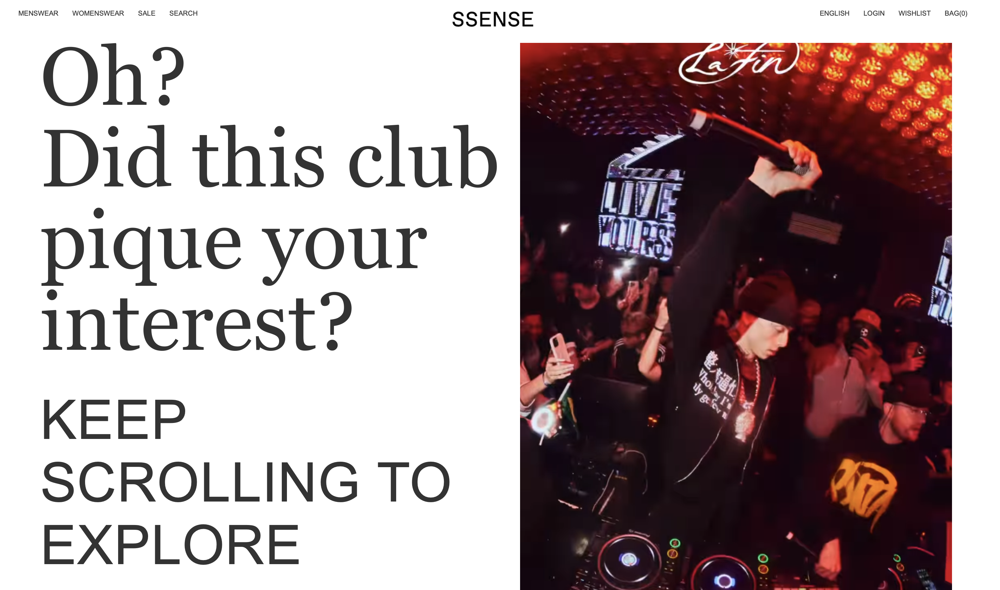
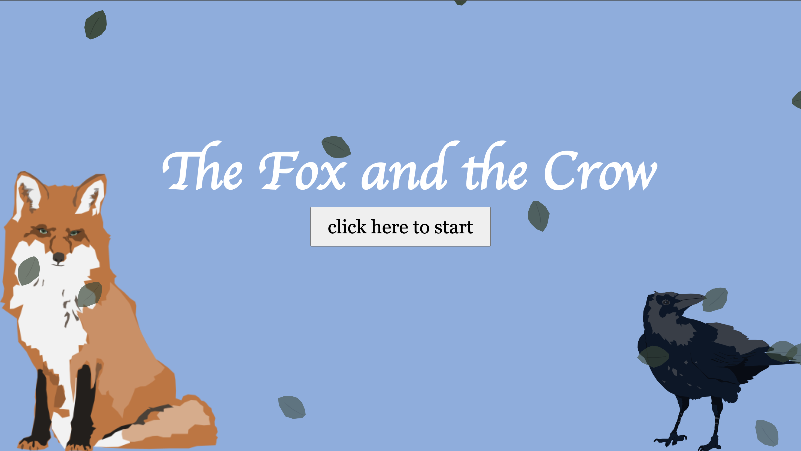
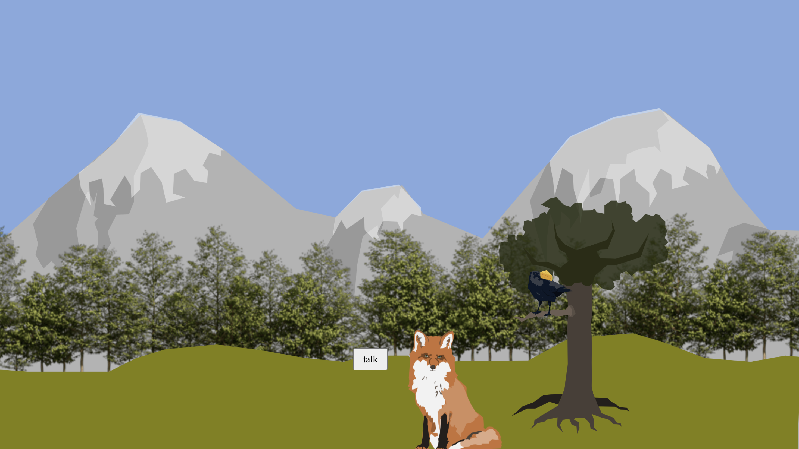
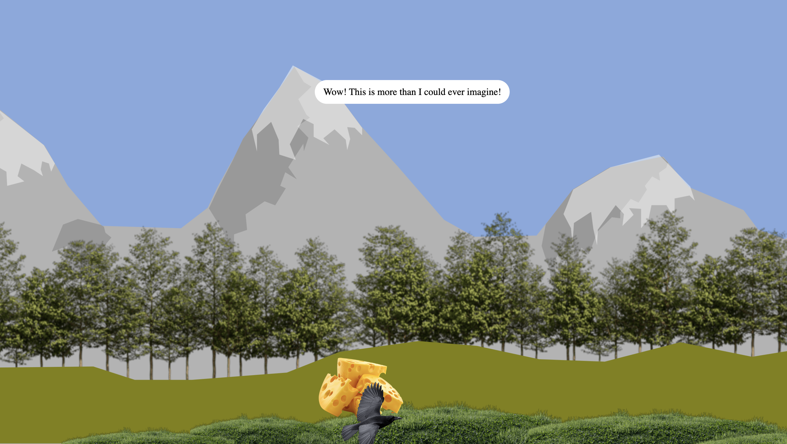

# Emerson's Comms lab page
## here you find my projects:
These are the projects I made
- Journey through spreadsheets
- [Life scroll](Astoryinmylife)
- [Tutorial on the web](Tutorial)

Below is a photo of me when I was younger: 

 

This is from my life scroll project. Made me reminisce my child years.

## Emerson Souder
### SSENSE - Asia Archive
[link](ssenserecreation)

Step inside the story

My project recreates SSENSE with a focus on Asian culture, nightlife, and music. Instead of only reading articles, users can interact with the stories and move through them as experiences.

My project takes inspiration from SSENSE but reimagines it with a focus on Asian fashion, culture, and nightlife. Instead of just reading articles, users move through them as interactive experiences that change as they click through the site. For example, a nightlife article about Shanghai turns into a sequence where the user gets ready and eventually enters the club. I wanted to make something that feels less static and more immersive, where the viewer is part of the story rather than just observing it. Overall, the project explores how fashion and cultural content can be presented in a more engaging and experiential way through digital design.

This is a lower section of the homepage that extends the editorial experience by linking users to music and additional pages inspired by SSENSE.

This page is a lower section of the homepage that extends the editorial experience by linking users to music and additional pages inspired by SSENSE.

## Emerson Souder
## The Fox and the Crow - Don’t allow yourself to be deceived by flattery.

[link](final)

This website is an adaptation of the poem “The Fox and the Crow”. It tells the story of a fox that is hungry for food, and smells what could be his next meal.

My project adapts the fable “The Fox and the Crow” into an interactive web experience. In the story, a fox smells food and follows the scent until he finds a crow sitting on a branch with a piece of cheese. The fox flatters the crow by complimenting its feathers and asking to hear its voice. Wanting to impress the fox, the crow opens its mouth, drops the cheese, and the fox steals it. My website translates this interaction through animation, dialogue, text bubbles, and clickable buttons that guide the user through the story. After the fox leaves, the user can explore the crow’s perspective and follow it in search of another meal. The experience eventually loops back to the beginning, reinforcing the central idea that people often repeat the same mistakes instead of learning from them.

This screenshot shows the interaction between the fox and the crow. As seen in the crows mouth is a piece of cheese, which will drop once the dialogue between the animals is complete.

This image shows when the crow discovers a pile of cheese, leading him to believe he is set to have meals for a very long time. But this happiness does not last very long as the crow will be fooled once again by flattery.

